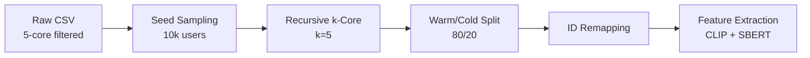
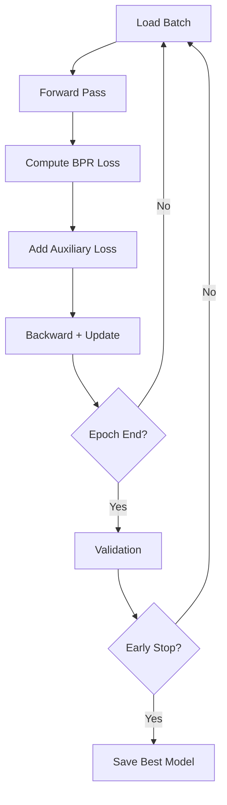
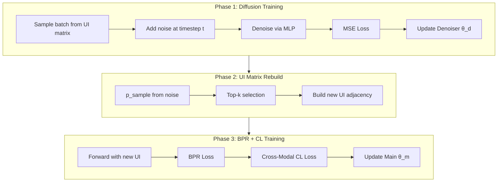

# Model Setup and Configuration

This document provides technical documentation for the LATTICE, MICRO, and DiffMM multimodal recommendation system implementation.

---

## Table of Contents

1. [Overview](#1-overview)
2. [Data Preprocessing](#2-data-preprocessing)
3. [Model Architecture](#3-model-architecture)
4. [Training Pipeline](#4-training-pipeline)
5. [Evaluation Protocol](#5-evaluation-protocol)
6. [Ablation Studies](#6-ablation-studies)
7. [Project Structure](#7-project-structure)

---

## 1. Overview

This project implements three multimodal recommendation models with **inductive cold-start evaluation**:

| Model | Architecture | Key Technique | Reference |
|-------|-------------|---------------|-----------|
| **LATTICE** | k-NN Graph + LightGCN | Learned item-item graph from modal features | Zhang et al., 2021 |
| **MICRO** | Contrastive Multimodal | InfoNCE alignment of visual/text/ID | Zhang et al., 2022 |
| **DiffMM** | Diffusion + GCN | Denoising diffusion for UI matrix reconstruction | Jiang et al., 2024 |

All models share a common evaluation framework supporting warm-item and cold-item (inductive) testing.

---

## 2. Data Preprocessing

### 2.1 Pipeline Overview



### 2.2 Configuration Parameters

| Parameter | Value | Description |
|-----------|-------|-------------|
| `seed_users` | 10,000 | Initial user sample size |
| `k_core` | 5 | Minimum interactions per user/item |
| `cold_item_ratio` | 0.20 | Fraction of items held as cold |
| `train_ratio` | 0.80 | Training split from warm interactions |
| `val_ratio` | 0.10 | Validation split |
| `test_warm_ratio` | 0.10 | Warm test split |

### 2.3 Warm/Cold Item Split

Items are assigned contiguous IDs:
- **Warm Items**: IDs `[0, N_warm - 1]` — appear in training
- **Cold Items**: IDs `[N_warm, N_total - 1]` — never appear in training

> [!IMPORTANT]
> Cold items have no ID embeddings during training. Their representations must derive entirely from multimodal features.

### 2.4 Feature Extraction

**Visual Features (CLIP ViT-L/14)**
- Model: `openai/clip-vit-large-patch14`
- Output: 768-dimensional embeddings
- Batch size: 64 (parallel image downloads)

**Text Features (Sentence-BERT)**
- Model: `sentence-transformers/all-mpnet-base-v2`
- Input: `title + description + features`
- Output: 768-dimensional embeddings

**Anisotropy Correction**:
All features are L2-normalized, mean-centered (using warm items only), then re-normalized.

### 2.5 Output Files

```
data/processed/{dataset}/
├── train.txt          # user_idx item_idx (warm items only)
├── val.txt            # user_idx item_idx (warm items only)
├── test_warm.txt      # user_idx item_idx (warm items only)
├── test_cold.txt      # user_idx item_idx (cold items only)
├── feat_visual.npy    # (N_items, 768) float32
├── feat_text.npy      # (N_items, 768) float32
└── maps.json          # ID mappings and metadata
```

---

## 3. Model Architecture

### 3.1 Shared Configuration

All models use the following hyperparameters:

| Parameter | Value | Description |
|-----------|-------|-------------|
| `EMBED_DIM` | 384 | Embedding dimension (divisible by 6, 12 for attention) |
| `N_LAYERS` | 3 | GCN propagation layers |
| `BATCH_SIZE` | 1024 | Training batch size |
| `LR` | 5e-4 | Learning rate |
| `L2_REG` | 1e-3 | L2 regularization weight |
| `EPOCHS` | 150 | Maximum training epochs |
| `PATIENCE` | 25 | Early stopping patience |
| `N_NEGATIVES` | 1 | Negatives per positive sample |

### 3.2 Modality Projection

All models project 768-dim modal features to `EMBED_DIM` using an MLP:

```
768 (CLIP/SBERT) → 1024 (hidden) → LeakyReLU → Dropout(0.5) → 384 (embed_dim)
```

| Parameter | Value |
|-----------|-------|
| `PROJECTION_HIDDEN_DIM` | 1024 |
| `PROJECTION_DROPOUT` | 0.5 |

### 3.3 LATTICE Configuration

LATTICE constructs a learned item-item graph from modal features and combines it with the original graph via weighted averaging.

| Parameter | Value | Description |
|-----------|-------|-------------|
| `LATTICE_K` | 10 | k-NN neighbors for graph construction |
| `LATTICE_LAMBDA` | 0.9 | Weight for original graph (1-λ for learned) |
| `LATTICE_FEAT_EMBED_DIM` | 64 | Modal feature projection for graph building |
| `LATTICE_N_ITEM_LAYERS` | 1 | Item graph propagation layers |

### 3.4 MICRO Configuration

MICRO uses InfoNCE contrastive learning to align visual, text, and ID embeddings.

| Parameter | Value | Description |
|-----------|-------|-------------|
| `MICRO_TAU` | 0.5 | InfoNCE temperature |
| `MICRO_LOSS_RATIO` | 0.03 | Contrastive loss weight |
| `MICRO_TOPK` | 10 | k-NN neighbors |
| `MICRO_LAMBDA` | 0.9 | Original graph weight |
| `MICRO_ITEM_LAYERS` | 1 | Item graph layers |

### 3.5 DiffMM Configuration

DiffMM employs a diffusion process to denoise user-item interaction signals and uses contrastive learning for modality alignment.

| Parameter | Value | Description |
|-----------|-------|-------------|
| `DIFFMM_STEPS` | 5 | Diffusion timesteps |
| `DIFFMM_NOISE_SCALE` | 0.1 | Base noise scale |
| `DIFFMM_NOISE_MIN` | 0.0001 | Minimum noise level |
| `DIFFMM_NOISE_MAX` | 0.02 | Maximum noise level |
| `DIFFMM_DIMS` | [1000] | Denoiser MLP hidden dimensions |
| `DIFFMM_REBUILD_K` | 1 | Top-k for UI matrix rebuild |
| `DIFFMM_E_LOSS` | 0.1 | GraphCL loss weight |
| `DIFFMM_SSL_REG` | 0.01 | Cross-modal contrastive weight |
| `DIFFMM_TEMP` | 0.5 | Contrastive temperature |
| `DIFFMM_KEEP_RATE` | 0.5 | Edge dropout keep rate |

---

## 4. Training Pipeline

### 4.1 Standard Training (LATTICE, MICRO)



### 4.2 DiffMM Three-Phase Training

DiffMM employs a specialized three-phase training loop per epoch, matching the original implementation:



**Separate Optimizers**: DiffMM uses two optimizers:
- `denoise_optimizer`: Updates denoiser parameters (Phase 1)
- `main_optimizer`: Updates all other parameters (Phase 3)

### 4.3 Loss Functions

**BPR Loss** (all models):
$$\mathcal{L}_{BPR} = -\sum_{(u,i,j)} \log \sigma(\hat{y}_{ui} - \hat{y}_{uj})$$

**Auxiliary Losses**:
- **MICRO**: InfoNCE for modal-ID alignment
- **DiffMM**: Diffusion MSE + Cross-modal contrastive

### 4.4 Learning Rate Schedule

All models use **Cosine Annealing** with `T_max = EPOCHS`.

---

## 5. Evaluation Protocol

### 5.1 Three-Track Evaluation

| Track | Split | Users | Purpose |
|-------|-------|-------|---------|
| 1 | test_warm | All | Standard performance |
| 2a | test_warm | Sparse (≤5 interactions) | User robustness |
| 2b | test_warm | Active (≥20 interactions) | User robustness |
| 3 | test_cold | All (inductive mode) | Cold-start ability |

### 5.2 Metrics

- **Recall@K** (K = 10, 20, 50)
- **NDCG@K** (K = 10, 20, 50)
- **Precision@K** (K = 10, 20, 50)

### 5.3 Cold-Start Inference

For Track 3, item embeddings are generated from modal features only:

| Model | Method |
|-------|--------|
| LATTICE | `cold_proj(visual + text)` → 384-dim |
| MICRO | `image_trs(visual) + text_trs(text)` |
| DiffMM | `getImageFeats() + getTextFeats()` |

---

## 6. Ablation Studies

### 6.1 Modality Ablation

The system supports modality-masked training via CLI:

```bash
python src/main.py --model lattice --dataset electronics --ablation no_visual
python src/main.py --model micro --dataset electronics --ablation no_text
```

| Mode | Effect |
|------|--------|
| `no_visual` | Visual features replaced with noise (ε=1e-6) |
| `no_text` | Text features replaced with noise (ε=1e-6) |

> [!NOTE]
> Small random noise is used instead of zeros to prevent NaN in normalization operations.

### 6.2 Checkpoint Routing

Ablation runs are automatically saved to separate directories:
- `checkpoints_ablation/{dataset}/{model}_{ablation}/`

---

## 7. Project Structure

```
src/
├── common/
│   ├── config.py          # Unified hyperparameters
│   └── utils.py           # Seed, device, early stopping
├── preprocessing/
│   ├── inductive_config.py
│   ├── inductive_pipeline.py
│   └── run_preprocessing.py
├── models/
│   ├── base.py            # Abstract base class
│   ├── lattice.py         # LATTICE implementation
│   ├── micro.py           # MICRO implementation
│   └── diffmm.py          # DiffMM implementation
├── dataset.py             # DataLoader, adjacency matrix
├── trainer.py             # Training loop (incl. DiffMM three-phase)
├── evaluator.py           # Metrics computation
└── main.py                # CLI entry point
```

---

## References

1. Zhang, J. et al. (2021). *Mining Latent Structures for Multimedia Recommendation.* ACM MM.
2. Zhang, J. et al. (2022). *Multimodal Graph Contrastive Learning for Multimedia-Based Recommendation.* ACM MM.
3. Jiang, Y. et al. (2024). *DiffMM: Multi-Modal Diffusion Model for Recommendation.* arXiv.
