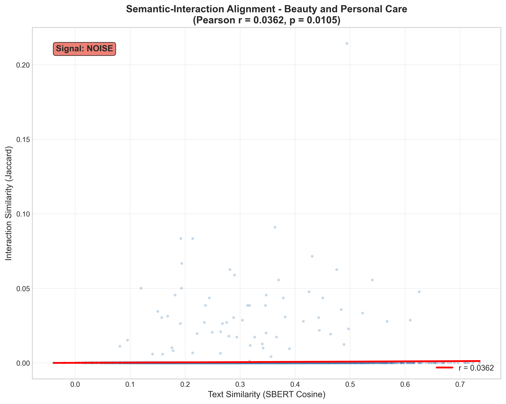

# EDA Report: Beauty and Personal Care

**Generated:** 2025-12-17T20:38:09.484629  
**Sampling Strategy:** Dense (K-Core k=5 + 60 months)
**Sampling Ratio:** 0.02

---

## 1. Data Overview

### Loading Statistics

| Metric | Interactions | Metadata |
|--------|-------------|----------|
| Total Records | 23,911,390 | 1,028,914 |
| Sampled Records | 3,564,071 | 135,104 |
| Memory (MB) | 2001.27 | 298.22 |

### Interaction Statistics

| Metric | Value |
|--------|-------|
| Users | 384,826 |
| Items | 135,104 |
| Interactions | 3,564,071 |
| Avg Rating | 4.25 |
| Rating Std | 1.26 |
| Sparsity | 99.99314490% |

---

## 2. Rating Distribution

| Rating | Count | Percentage |
|--------|-------|------------|
| 1.0 | 287,523 | 8.1% |
| 2.0 | 167,720 | 4.7% |
| 3.0 | 285,383 | 8.0% |
| 4.0 | 460,135 | 12.9% |
| 5.0 | 2,363,310 | 66.3% |

---

## 3. User and Item Analysis

### Power-Law Distribution

**User Patterns:**
- Mean interactions/user: 9.26
- Median interactions/user: 6.0
- Cold-start users (<5 interactions): 0.0%
- Power-law exponent α: 3.00

**Item Patterns:**
- Mean interactions/item: 26.38
- Median interactions/item: 12.0
- Cold-start items (<5 interactions): 0.0%
- Power-law exponent α: 1.88

### Pareto Analysis (Interaction Concentration)

Top users account for a disproportionate share of interactions:

| User Tier | % of Total Interactions |
|-----------|------------------------|
| Top 1% | 14.0% |
| Top 5% | 25.4% |
| Top 10% | 33.7% |
| Top 20% | 46.0% |
| Top 50% | 71.0% |
| Top 100% | 100.0% |

---

## 4. Temporal Analysis

**Date Range:** 2018-10-09 to 2023-09-12  
**Duration:** 1,798 days

---

## 5. Text Analysis

| Metric | Value |
|--------|-------|
| Avg Review Length | 216 chars |
| Avg Title Length | 20 chars |
| Reviews with Text | 100.0% |

---

## 6. Multimodal Analysis

### Feature Coverage

| Feature | Coverage |
|---------|----------|
| Title | 100.0% |
| Description | 39.5% |
| Features | 85.7% |
| Images | 100.0% |
| **Complete (Text + Image)** | 100.0% |

### Image Statistics

| Metric | Value |
|--------|-------|
| Items with Images | 135,102 |
| Avg Images/Item | 6.20 |

---

## 7. Sparsity and K-Core Analysis

**Matrix Sparsity:** 99.99314490%  
**Density:** 0.00685510%

### K-Core Filtering Impact

| k | Users Retained | Items Retained | Interactions Retained |
|---|----------------|----------------|----------------------|
| 2 | 100.0% | 100.0% | 100.0% |
| 3 | 100.0% | 100.0% | 100.0% |
| 5 | 100.0% | 100.0% | 100.0% |
| 10 | 10.1% | 27.8% | 25.4% |
| 20 | 0.2% | 0.8% | 1.1% |

---

## 8. Category Distribution

Top categories in the dataset:

| Category | Count |
|----------|-------|
| Beauty & Personal Care | 135,104 |

---

## 9. Key Insights and Recommendations

### Data Quality
1. **High Sparsity:** The dataset exhibits extreme sparsity typical of recommendation datasets
2. **Power-Law Distribution:** Both users and items follow power-law distributions (long-tail)
3. **Cold-Start Challenge:** Significant portion of users/items have few interactions

### Preprocessing Recommendations
1. **K-Core Filtering:** Use k=5 as baseline (balances data quality vs. coverage)
2. **Multimodal Features:** Leverage text/image to address cold-start problem
3. **Negative Sampling:** Use popularity-based hard negative sampling for BPR

---

## 10. Multimodal Recommendation Readiness (Academic Analysis)

### 10.1 Modality-Interaction Alignment (Liu et al., 2024)

Tests the **Homophily Hypothesis**: Do visually similar items share similar interaction patterns?

| Metric | Value |
|--------|-------|
| Pairs Analyzed | 20,000 |
| Pearson r | 0.0161 |
| p-value | 0.0226 |
| Spearman ρ | 0.0179 |

**Interpretation:** Very weak correlation - visual signal exists but is minimal

### 10.2 Visual Manifold Structure (Xu et al., 2025)

Analyzes whether CLIP embeddings form meaningful clusters by category.

| Metric | Value |
|--------|-------|
| Items Projected | 10,000 |
| Projection Method | UMAP |
| Silhouette Score | 0.0000 |
| Unique Categories | 1 |

**Interpretation:** No meaningful visual clustering - visual features may not align with categories

### 10.3 BPR Negative Sampling Hardness (Xu et al., 2025)

Evaluates whether random negative sampling produces informative training signal.

| Metric | Value |
|--------|-------|
| Users Analyzed | 2,000 |
| Pairs Analyzed | 40,000 |
| Mean Visual Distance | 0.5052 |
| Easy Negatives (>0.8) | 0.1% |
| Medium Negatives | 98.7% |
| Hard Negatives (<0.3) | 1.3% |

**Interpretation:** Moderate negative difficulty - room for improvement

**Recommendation:** Consider mixing random and hard negative sampling

### 10.4 Text Embedding Extraction (Sentence-BERT)

| Metric | Value |
|--------|-------|
| Model | `sentence-transformers/all-mpnet-base-v2` |
| Items Processed | 25,000 |
| Success Rate | 100.0% |
| Embedding Dimension | 768 |
| Processing Time | 164.3s |
| Throughput | 152.2 items/sec |
| Avg Text Length | 439 chars |

### 10.5 Semantic-Interaction Alignment (Text)

Tests whether items with similar text descriptions have similar buyers.

| Metric | Value |
|--------|-------|
| Pairs Analyzed | 7,500 |
| Pearson r | 0.0395 |
| p-value | 0.0006 |
| Mean Text Similarity | 0.2918 |
| Mean Interaction Similarity | 0.0002 |
| **Signal Strength** | 🔴 NOISE |

**Interpretation:** Very weak correlation (r=0.0395): Text descriptions do NOT predict user behavior. Users likely buy based on visual appeal, brand, or price rather than descriptions.

**Recommendation:** Deprioritize text encoder in final model, or use text only as filter/fallback.

### 10.6 Cross-Modal Consistency (Text vs Image)

Measures whether text and image embeddings agree for the same items.

| Metric | Value |
|--------|-------|
| Items with Both Modalities | 3,536 |
| Projection Method | linear |
| Text Dim → Projected | 768 → 768 |
| Image Dim → Projected | 768 → 768 |
| **Mean Similarity** | 0.0088 |
| Std Similarity | 0.0325 |
| Low Agreement (<0.3) | 100.0% |
| Moderate (0.3-0.6) | 0.0% |
| High Agreement (>0.6) | 0.0% |
| **Status** | 🔴 DISAGREE |

**Interpretation:** LOW cross-modal agreement (avg=0.009): Text and image embeddings point in different directions. This indicates a fundamental mismatch - either descriptions don't match images, or encoders have domain shift.

**Recommendation:** Investigate: (1) Check if product images match descriptions, (2) Fine-tune encoders on domain, (3) Use separate modality branches.

---

## 11. LATTICE Feasibility Assessment

> [!TIP]
> ✅ **PROCEED** with LATTICE architecture - All feasibility checks passed.

### 11.1 Graph Connectivity (k-NN, k=5)

| Metric | Value | Status |
|--------|-------|--------|
| Connected Components | 1 | - |
| Giant Component Size | 10,000 | - |
| Giant Component Coverage | 100.0% | ✅ PASS |
| Threshold | >50.0% | - |

**Interpretation:** PASS: Giant component covers 100.0% of items (threshold: 50.0%). Graph is sufficiently connected for LATTICE.

### 11.2 Feature Collapse Detection (White Wall Test)

| Metric | Value | Status |
|--------|-------|--------|
| Pairs Sampled | 50,000 | - |
| Avg Cosine Similarity | 0.4953 | ✅ PASS |
| Std Cosine Similarity | 0.0899 | - |
| High Similarity Pairs (>0.9) | 0.0% | - |
| Pass Threshold | <0.5 | - |

**Interpretation:** PASS: Avg cosine similarity = 0.495 (threshold: 0.5). Features show good variance. Visual encoder is producing discriminative embeddings.

### Summary

| Check | Value | Status |
|-------|-------|--------|
| Alignment (Pearson r) | 0.0161 | ✅ |
| Connectivity (Giant %) | 100.0% | ✅ |
| No Collapse (Avg Cosine) | 0.4953 | ✅ |

**Decision:** PROCEED

---

*Report generated by EDA Pipeline for Multimodal Recommendation System*
