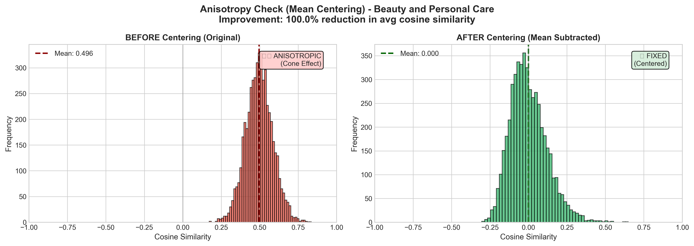
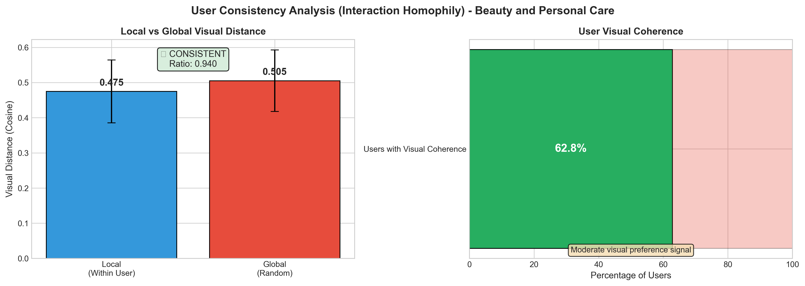

# EDA Report: Beauty and Personal Care

**Generated:** 2025-12-18T10:22:34.672870  
**Sampling Strategy:** random

---

## 1. Data Overview

### Loading Statistics

| Metric | Interactions | Metadata |
|--------|-------------|----------|
| Total Records | 6,624,441 | 1,028,914 |
| Sampled Records | 6,624,441 | 207,649 |
| Memory (MB) | 1636.28 | 439.73 |

### Interaction Statistics

| Metric | Value |
|--------|-------|
| Users | 729,576 |
| Items | 207,649 |
| Interactions | 6,624,441 |
| Avg Rating | 4.23 |
| Rating Std | 1.26 |
| Sparsity | 99.99562731% |

---

## 2. Rating Distribution

| Rating | Count | Percentage |
|--------|-------|------------|
| 1.0 | 524,838 | 7.9% |
| 2.0 | 334,932 | 5.1% |
| 3.0 | 547,736 | 8.3% |
| 4.0 | 872,391 | 13.2% |
| 5.0 | 4,344,544 | 65.6% |

---

## 3. User and Item Analysis

### Power-Law Distribution

**User Patterns:**
- Mean interactions/user: 9.08
- Median interactions/user: 7.0
- Cold-start users (<5 interactions): 0.0%
- Power-law exponent α: 2.94

**Item Patterns:**
- Mean interactions/item: 31.90
- Median interactions/item: 12.0
- Cold-start items (<5 interactions): 0.0%
- Power-law exponent α: 1.83

### Pareto Analysis (Interaction Concentration)

Top users account for a disproportionate share of interactions:

| User Tier | % of Total Interactions |
|-----------|------------------------|
| Top 1% | 10.6% |
| Top 5% | 21.9% |
| Top 10% | 30.7% |
| Top 20% | 43.7% |
| Top 50% | 70.3% |
| Top 100% | 100.0% |

---

## 4. Temporal Analysis

**Date Range:** 2000-12-20 to 2023-09-12  
**Duration:** 8,301 days

---

## 5. Text Analysis

| Metric | Value |
|--------|-------|
| Avg Review Length | 0 chars |
| Avg Title Length | 0 chars |
| Reviews with Text | 0.0% |

---

## 6. Multimodal Analysis

### Feature Coverage

| Feature | Coverage |
|---------|----------|
| Title | 100.0% |
| Description | 48.3% |
| Features | 82.6% |
| Images | 100.0% |
| **Complete (Text + Image)** | 100.0% |

### Image Statistics

| Metric | Value |
|--------|-------|
| Items with Images | 207,648 |
| Avg Images/Item | 5.49 |

---

## 7. Sparsity and K-Core Analysis

**Matrix Sparsity:** 99.99562731%  
**Density:** 0.00437269%

### K-Core Filtering Impact

| k | Users Retained | Items Retained | Interactions Retained |
|---|----------------|----------------|----------------------|
| 2 | 100.0% | 100.0% | 100.0% |
| 3 | 100.0% | 100.0% | 100.0% |
| 5 | 100.0% | 100.0% | 100.0% |
| 10 | 13.9% | 29.7% | 28.8% |
| 20 | 0.0% | 0.0% | 0.0% |

---

## 8. Category Distribution

Top categories in the dataset:

| Category | Count |
|----------|-------|
| Beauty & Personal Care | 207,649 |

---

## 9. Key Insights and Recommendations

### Data Quality
1. **High Sparsity:** The dataset exhibits extreme sparsity typical of recommendation datasets
2. **Power-Law Distribution:** Both users and items follow power-law distributions (long-tail)
3. **Cold-Start Challenge:** Significant portion of users/items have few interactions

### Preprocessing Recommendations
1. **K-Core Filtering:** Use k=5 as baseline (balances data quality vs. coverage)
2. **Multimodal Features:** Leverage text/image to address cold-start problem
3. **Negative Sampling:** Use popularity-based hard negative sampling for BPR

---

## 10. Multimodal Recommendation Readiness (Academic Analysis)

### 10.1 Modality-Interaction Alignment (Liu et al., 2024)

Tests the **Homophily Hypothesis**: Do visually similar items share similar interaction patterns?

| Metric | Value |
|--------|-------|
| Pairs Analyzed | 20,000 |
| Pearson r | -0.0063 |
| p-value | 0.3696 |
| Spearman ρ | -0.0191 |

**Interpretation:** No significant correlation - visual features may not align with user preferences

### 10.2 Visual Manifold Structure (Xu et al., 2025)

Analyzes whether CLIP embeddings form meaningful clusters by category.

| Metric | Value |
|--------|-------|
| Items Projected | 10,000 |
| Projection Method | UMAP |
| Silhouette Score | 0.0000 |
| Unique Categories | 1 |

**Interpretation:** No meaningful visual clustering - visual features may not align with categories

### 10.3 BPR Negative Sampling Hardness (Xu et al., 2025)

Evaluates whether random negative sampling produces informative training signal.

| Metric | Value |
|--------|-------|
| Users Analyzed | 2,000 |
| Pairs Analyzed | 40,000 |
| Mean Visual Distance | 0.4997 |
| Easy Negatives (>0.8) | 0.1% |
| Medium Negatives | 98.7% |
| Hard Negatives (<0.3) | 1.2% |

**Interpretation:** Moderate negative difficulty - room for improvement

**Recommendation:** Consider mixing random and hard negative sampling

### 10.4 Text Embedding Extraction (Sentence-BERT)

| Metric | Value |
|--------|-------|
| Model | `sentence-transformers/all-mpnet-base-v2` |
| Items Processed | 25,000 |
| Success Rate | 100.0% |
| Embedding Dimension | 768 |
| Processing Time | 141.9s |
| Throughput | 176.2 items/sec |
| Avg Text Length | 416 chars |

### 10.5 Semantic-Interaction Alignment (Text)

Tests whether items with similar text descriptions have similar buyers.

| Metric | Value |
|--------|-------|
| Pairs Analyzed | 7,500 |
| Pearson r | 0.025 |
| p-value | 0.0303 |
| Mean Text Similarity | 0.2883 |
| Mean Interaction Similarity | 0.0001 |
| **Signal Strength** | 🔴 NOISE |

**Interpretation:** Very weak correlation (r=0.0250): Text descriptions do NOT predict user behavior. Users likely buy based on visual appeal, brand, or price rather than descriptions.

**Recommendation:** Deprioritize text encoder in final model, or use text only as filter/fallback.

### 10.6 Cross-Modal Consistency (Text vs Image)

Measures whether text and image embeddings agree for the same items.

| Metric | Value |
|--------|-------|
| Items with Both Modalities | 4,884 |
| Projection Method | linear |
| Text Dim → Projected | 768 → 768 |
| Image Dim → Projected | 768 → 768 |
| **Mean Similarity** | 0.0088 |
| Std Similarity | 0.0321 |
| Low Agreement (<0.3) | 100.0% |
| Moderate (0.3-0.6) | 0.0% |
| High Agreement (>0.6) | 0.0% |
| **Status** | 🔴 DISAGREE |

**Interpretation:** LOW cross-modal agreement (avg=0.009): Text and image embeddings point in different directions. This indicates a fundamental mismatch - either descriptions don't match images, or encoders have domain shift.

**Recommendation:** Investigate: (1) Check if product images match descriptions, (2) Fine-tune encoders on domain, (3) Use separate modality branches.

### 10.7 CCA Cross-Modal Analysis

Canonical Correlation Analysis measures linear relationship capacity between modalities.

| Metric | Value |
|--------|-------|
| Items Analyzed | 4,884 |
| CCA Components | 10 |
| Mean CCA Correlation | 0.9026 |
| Top-5 Correlations | 0.963, 0.939, 0.932, 0.911, 0.900 |

**Interpretation:** STRONG CCA correlation (0.903). Good linear relationship between modalities.

**Recommendation:** MICRO contrastive loss should converge well.

### 10.8 Anisotropy Check (Signal Crisis Fix)

Detects "Cone Effect" in embeddings and tests if mean centering helps.

| Metric | Before Centering | After Centering |
|--------|------------------|-----------------|
| Avg Cosine Similarity | 0.4957 | 0.0001 |
| Std Cosine Similarity | 0.0875 | 0.1204 |
| Pairs Sampled | 20,000 | - |
| Improvement Ratio | 100.0% | - |
| **Status** | ⚠️ ANISOTROPIC | - |

**Interpretation:** ANISOTROPIC: Avg cosine = 0.496 (>0.4). Centering FIXED the issue: after centering = 0.000. Embeddings were in a narrow cone but centering spread them out.

**Recommendation:** Apply mean centering to all embeddings before using in MRS models. This should significantly improve LATTICE/MICRO performance.

### 10.9 User Consistency (Interaction Homophily)

Measures whether users buy visually similar items (validates visual MRS approach).

| Metric | Value |
|--------|-------|
| Users Analyzed | 1,500 |
| Users with ≥5 Items | 729,576 |
| Mean Local Distance | 0.4748 |
| Mean Global Distance | 0.5051 |
| **Consistency Ratio** | 0.9399 |
| Users with Visual Coherence | 62.8% |
| **Status** | ✅ CONSISTENT |

**Interpretation:** MODERATE CONSISTENCY: Some visual preference signal exists. Local (0.475) < Global (0.505). Ratio = 0.940.

**Recommendation:** Visual features have some predictive power. Consider combining with text features for better performance.

---

## 11. LATTICE Feasibility Assessment

> [!TIP]
> ✅ **PROCEED** with LATTICE architecture - All feasibility checks passed.

### 11.1 Graph Connectivity (k-NN, k=5)

| Metric | Value | Status |
|--------|-------|--------|
| Connected Components | 2 | - |
| Giant Component Size | 9,994 | - |
| Giant Component Coverage | 99.9% | ✅ PASS |
| Threshold | >50.0% | - |

**Interpretation:** PASS: Giant component covers 99.9% of items (threshold: 50.0%). Graph is sufficiently connected for LATTICE.

### 11.2 Feature Collapse Detection (White Wall Test)

| Metric | Value | Status |
|--------|-------|--------|
| Pairs Sampled | 50,000 | - |
| Avg Cosine Similarity | 0.4959 | ✅ PASS |
| Std Cosine Similarity | 0.0883 | - |
| High Similarity Pairs (>0.9) | 0.0% | - |
| Pass Threshold | <0.5 | - |

**Interpretation:** PASS: Avg cosine similarity = 0.496 (threshold: 0.5). Features show good variance. Visual encoder is producing discriminative embeddings.

### Summary

| Check | Value | Status |
|-------|-------|--------|
| Alignment (Pearson r) | -0.0063 | ✅ |
| Connectivity (Giant %) | 99.9% | ✅ |
| No Collapse (Avg Cosine) | 0.4959 | ✅ |

**Decision:** PROCEED

---

*Report generated by EDA Pipeline for Multimodal Recommendation System*
