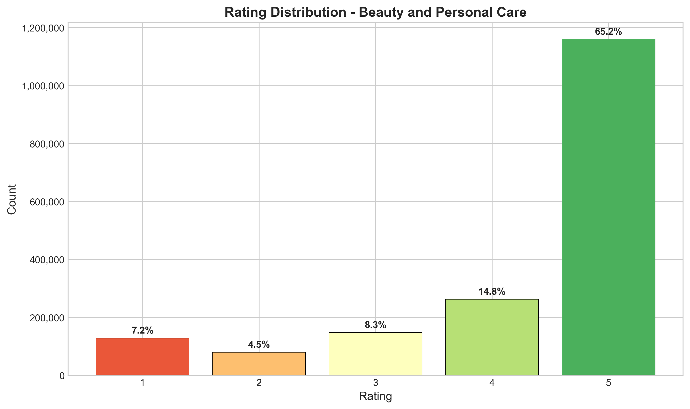
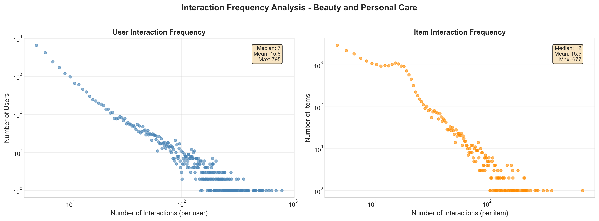
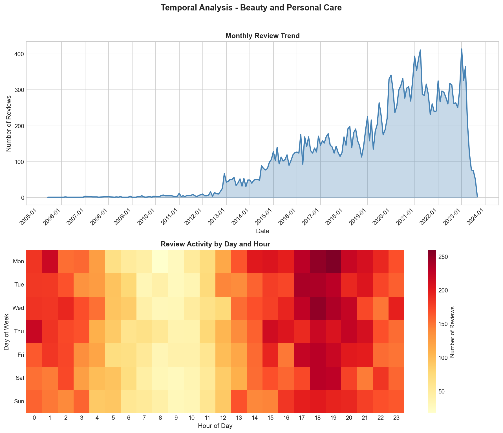
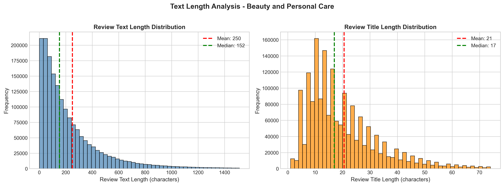
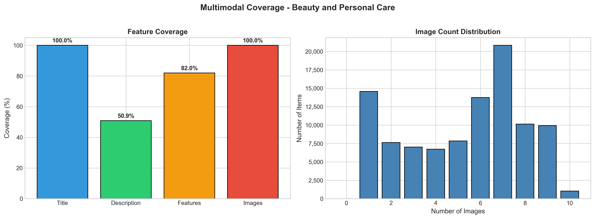
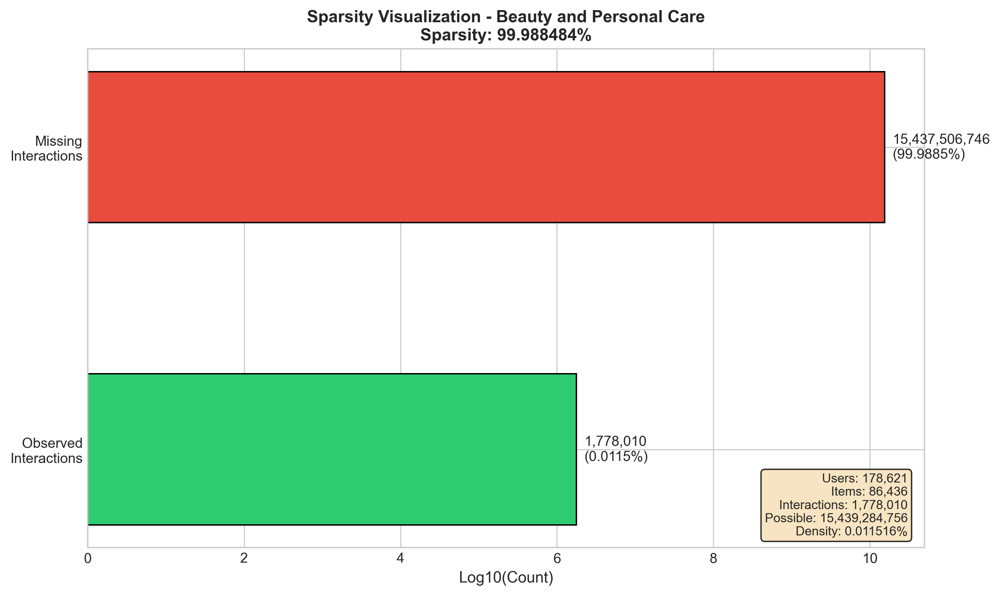
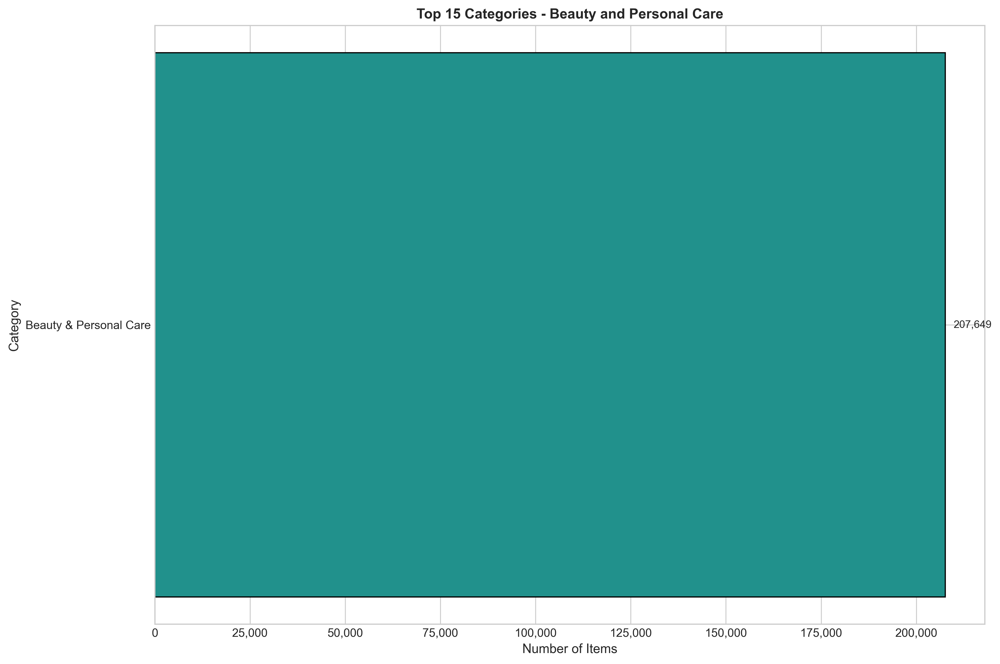
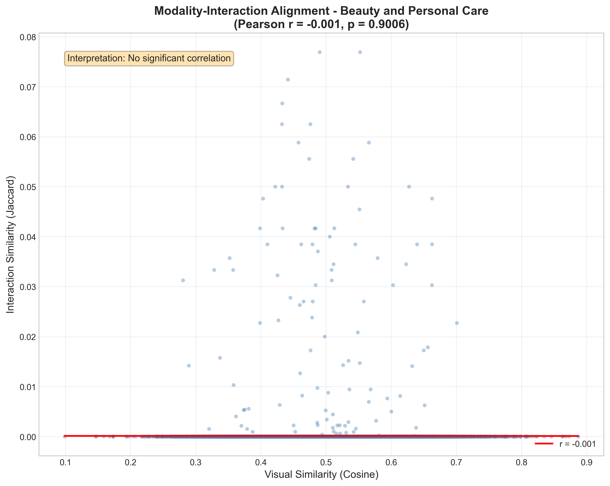
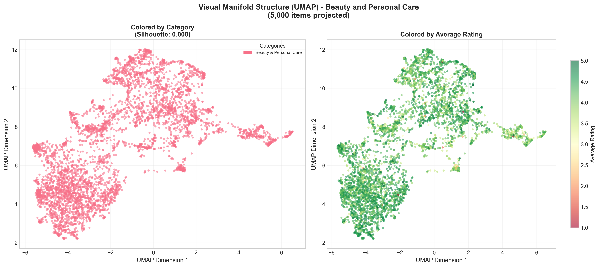
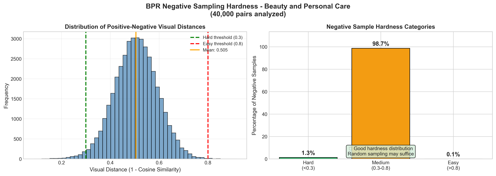

# EDA Report: Beauty and Personal Care

**Generated:** 2025-12-17T10:17:36.231980  
**Sample Ratio:** 1%

---

## 1. Data Overview

### Loading Statistics

| Metric | Interactions | Metadata |
|--------|-------------|----------|
| Total Records | 23,911,390 | 1,028,914 |
| Sampled Records | 235,765 | 101,165 |
| Memory (MB) | 112.45 | 193.99 |

### Interaction Statistics

| Metric | Value |
|--------|-------|
| Users | 113,631 |
| Items | 101,165 |
| Interactions | 235,765 |
| Avg Rating | 4.11 |
| Rating Std | 1.42 |
| Sparsity | 99.99794906% |

---

## 2. Rating Distribution

| Rating | Count | Percentage |
|--------|-------|------------|
| 1.0 | 28,360 | 12.0% |
| 2.0 | 12,437 | 5.3% |
| 3.0 | 16,861 | 7.2% |
| 4.0 | 25,031 | 10.6% |
| 5.0 | 153,076 | 64.9% |

---

## 3. User and Item Analysis

### Power-Law Distribution

**User Patterns:**
- Mean interactions/user: 2.07
- Median interactions/user: 1.0
- Cold-start users (<5 interactions): 92.3%
- Power-law exponent α: 1.89

**Item Patterns:**
- Mean interactions/item: 2.33
- Median interactions/item: 1.0
- Cold-start items (<5 interactions): 91.2%
- Power-law exponent α: 1.91

### Pareto Analysis (Interaction Concentration)

Top users account for a disproportionate share of interactions:

| User Tier | % of Total Interactions |
|-----------|------------------------|
| Top 1% | 11.3% |
| Top 5% | 26.6% |
| Top 10% | 37.7% |
| Top 20% | 52.7% |
| Top 50% | 75.9% |
| Top 100% | 100.0% |

---

## 4. Temporal Analysis

**Date Range:** 2003-11-21 to 2023-09-11  
**Duration:** 7,233 days

---

## 5. Text Analysis

| Metric | Value |
|--------|-------|
| Avg Review Length | 173 chars |
| Avg Title Length | 21 chars |
| Reviews with Text | 100.0% |

---

## 6. Multimodal Analysis

### Feature Coverage

| Feature | Coverage |
|---------|----------|
| Title | 100.0% |
| Description | 50.9% |
| Features | 82.0% |
| Images | 100.0% |
| **Complete (Text + Image)** | 100.0% |

### Image Statistics

| Metric | Value |
|--------|-------|
| Items with Images | 101,163 |
| Avg Images/Item | 5.42 |

---

## 7. Sparsity and K-Core Analysis

**Matrix Sparsity:** 99.99794906%  
**Density:** 0.00205094%

### K-Core Filtering Impact

| k | Users Retained | Items Retained | Interactions Retained |
|---|----------------|----------------|----------------------|
| 2 | 24.7% | 21.6% | 40.1% |
| 3 | 5.4% | 5.0% | 12.0% |
| 5 | 0.0% | 0.0% | 0.1% |
| 10 | 0.0% | 0.0% | 0.0% |
| 20 | 0.0% | 0.0% | 0.0% |

---

## 8. Category Distribution

Top categories in the dataset:

| Category | Count |
|----------|-------|
| Beauty & Personal Care | 101,165 |

---

## 9. Key Insights and Recommendations

### Data Quality
1. **High Sparsity:** The dataset exhibits extreme sparsity typical of recommendation datasets
2. **Power-Law Distribution:** Both users and items follow power-law distributions (long-tail)
3. **Cold-Start Challenge:** Significant portion of users/items have few interactions

### Preprocessing Recommendations
1. **K-Core Filtering:** Use k=5 as baseline (balances data quality vs. coverage)
2. **Multimodal Features:** Leverage text/image to address cold-start problem
3. **Negative Sampling:** Use popularity-based hard negative sampling for BPR

---

## 10. Multimodal Recommendation Readiness (Academic Analysis)

### 10.1 Modality-Interaction Alignment (Liu et al., 2024)

Tests the **Homophily Hypothesis**: Do visually similar items share similar interaction patterns?

| Metric | Value |
|--------|-------|
| Pairs Analyzed | 1,000 |
| Pearson r | nan |
| p-value | nan |
| Spearman ρ | nan |

**Interpretation:** Strong correlation - visual features strongly predict interaction patterns

### 10.2 Visual Manifold Structure (Xu et al., 2025)

Analyzes whether CLIP embeddings form meaningful clusters by category.

| Metric | Value |
|--------|-------|
| Items Projected | 5,000 |
| Projection Method | UMAP |
| Silhouette Score | 0.0000 |
| Unique Categories | 1 |

**Interpretation:** No meaningful visual clustering - visual features may not align with categories

### 10.3 BPR Negative Sampling Hardness (Xu et al., 2025)

Evaluates whether random negative sampling produces informative training signal.

| Metric | Value |
|--------|-------|
| Users Analyzed | 100 |
| Pairs Analyzed | 1,000 |
| Mean Visual Distance | 0.4398 |
| Easy Negatives (>0.8) | 0.0% |
| Medium Negatives | 94.4% |
| Hard Negatives (<0.3) | 5.6% |

**Interpretation:** Moderate negative difficulty - room for improvement

**Recommendation:** Consider mixing random and hard negative sampling

---

*Report generated by EDA Pipeline for Multimodal Recommendation System*
