# EDA Report: Clothing, Shoes and Jewelry

**Generated:** 2025-12-17T21:06:24.172778  
**Sampling Strategy:** Dense (K-Core k=5 + 60 months)
**Sampling Ratio:** 0.01

---

## 1. Data Overview

### Loading Statistics

| Metric | Interactions | Metadata |
|--------|-------------|----------|
| Total Records | 66,033,346 | 7,218,481 |
| Sampled Records | 13,531,827 | 422,138 |
| Memory (MB) | 6425.32 | 834.5 |

### Interaction Statistics

| Metric | Value |
|--------|-------|
| Users | 1,522,016 |
| Items | 422,138 |
| Interactions | 13,531,827 |
| Avg Rating | 4.29 |
| Rating Std | 1.20 |
| Sparsity | 99.99789388% |

---

## 2. Rating Distribution

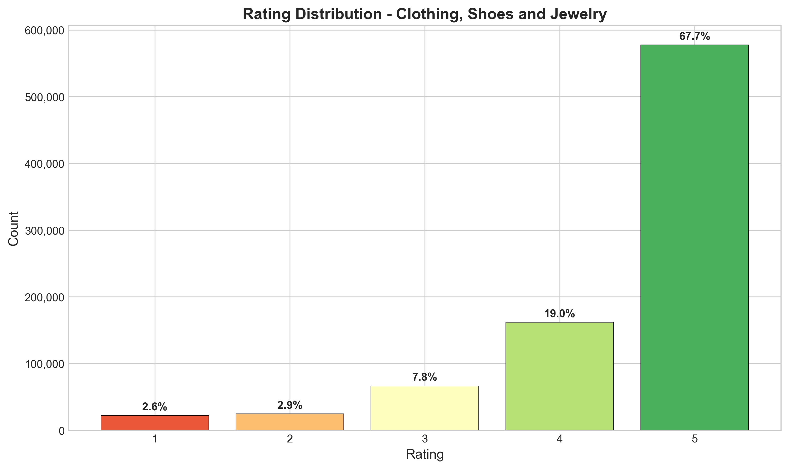

| Rating | Count | Percentage |
|--------|-------|------------|
| 1.0 | 877,591 | 6.5% |
| 2.0 | 652,327 | 4.8% |
| 3.0 | 1,149,144 | 8.5% |
| 4.0 | 1,801,625 | 13.3% |
| 5.0 | 9,051,140 | 66.9% |

---

## 3. User and Item Analysis

### Power-Law Distribution

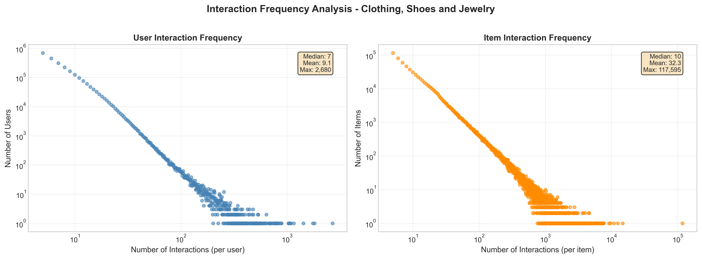

**User Patterns:**
- Mean interactions/user: 8.89
- Median interactions/user: 7.0
- Cold-start users (<5 interactions): 0.0%
- Power-law exponent α: 2.90

**Item Patterns:**
- Mean interactions/item: 32.06
- Median interactions/item: 11.0
- Cold-start items (<5 interactions): 0.0%
- Power-law exponent α: 1.88

### Pareto Analysis (Interaction Concentration)

Top users account for a disproportionate share of interactions:

| User Tier | % of Total Interactions |
|-----------|------------------------|
| Top 1% | 7.9% |
| Top 5% | 19.0% |
| Top 10% | 28.1% |
| Top 20% | 41.6% |
| Top 50% | 69.2% |
| Top 100% | 100.0% |

---

## 4. Temporal Analysis

**Date Range:** 2018-10-09 to 2023-09-12  
**Duration:** 1,799 days

---

## 5. Text Analysis

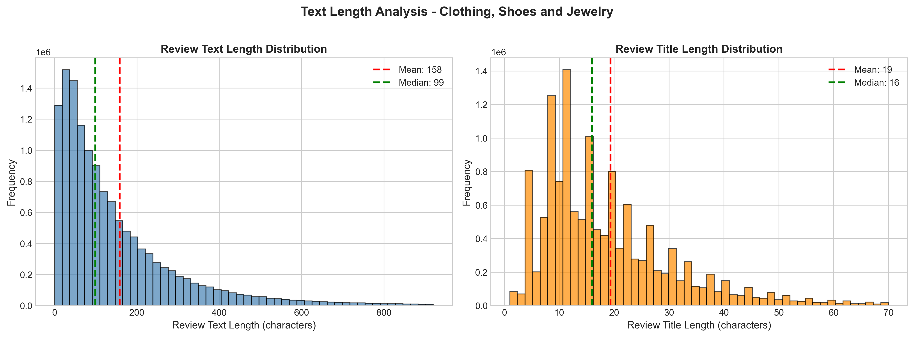

| Metric | Value |
|--------|-------|
| Avg Review Length | 158 chars |
| Avg Title Length | 19 chars |
| Reviews with Text | 100.0% |

---

## 6. Multimodal Analysis

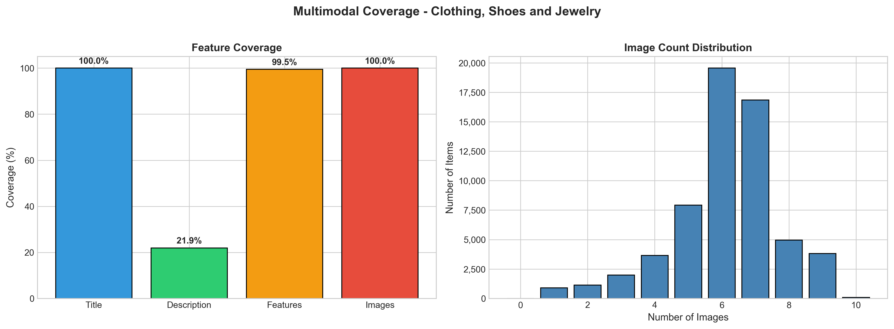

### Feature Coverage

| Feature | Coverage |
|---------|----------|
| Title | 100.0% |
| Description | 41.5% |
| Features | 97.2% |
| Images | 100.0% |
| **Complete (Text + Image)** | 100.0% |

### Image Statistics

| Metric | Value |
|--------|-------|
| Items with Images | 422,087 |
| Avg Images/Item | 5.62 |

---

## 7. Sparsity and K-Core Analysis

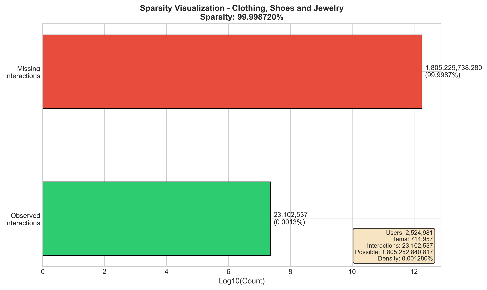

**Matrix Sparsity:** 99.99789388%  
**Density:** 0.00210612%

### K-Core Filtering Impact

| k | Users Retained | Items Retained | Interactions Retained |
|---|----------------|----------------|----------------------|
| 2 | 100.0% | 100.0% | 100.0% |
| 3 | 100.0% | 100.0% | 100.0% |
| 5 | 100.0% | 100.0% | 100.0% |
| 10 | 14.7% | 25.8% | 27.5% |
| 20 | 0.0% | 0.0% | 0.0% |

---

## 8. Category Distribution

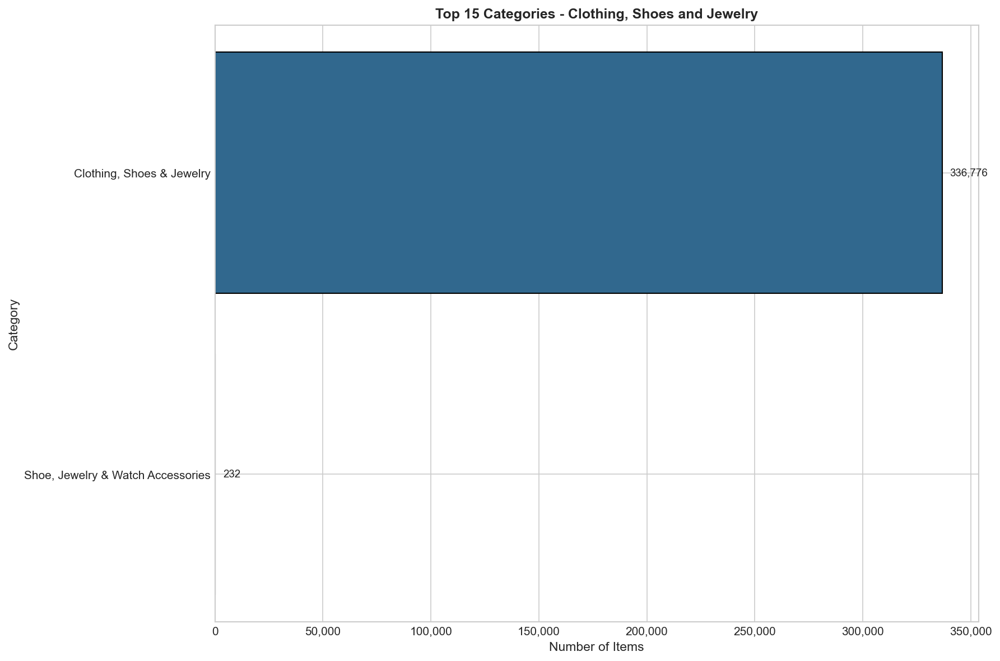

Top categories in the dataset:

| Category | Count |
|----------|-------|
| Clothing, Shoes & Jewelry | 421,796 |
| Shoe, Jewelry & Watch Accessories | 342 |

---

## 9. Key Insights and Recommendations

### Data Quality
1. **High Sparsity:** The dataset exhibits extreme sparsity typical of recommendation datasets
2. **Power-Law Distribution:** Both users and items follow power-law distributions (long-tail)
3. **Cold-Start Challenge:** Significant portion of users/items have few interactions

### Preprocessing Recommendations
1. **K-Core Filtering:** Use k=5 as baseline (balances data quality vs. coverage)
2. **Multimodal Features:** Leverage text/image to address cold-start problem
3. **Negative Sampling:** Use popularity-based hard negative sampling for BPR

---

## 10. Multimodal Recommendation Readiness (Academic Analysis)

### 10.1 Modality-Interaction Alignment (Liu et al., 2024)

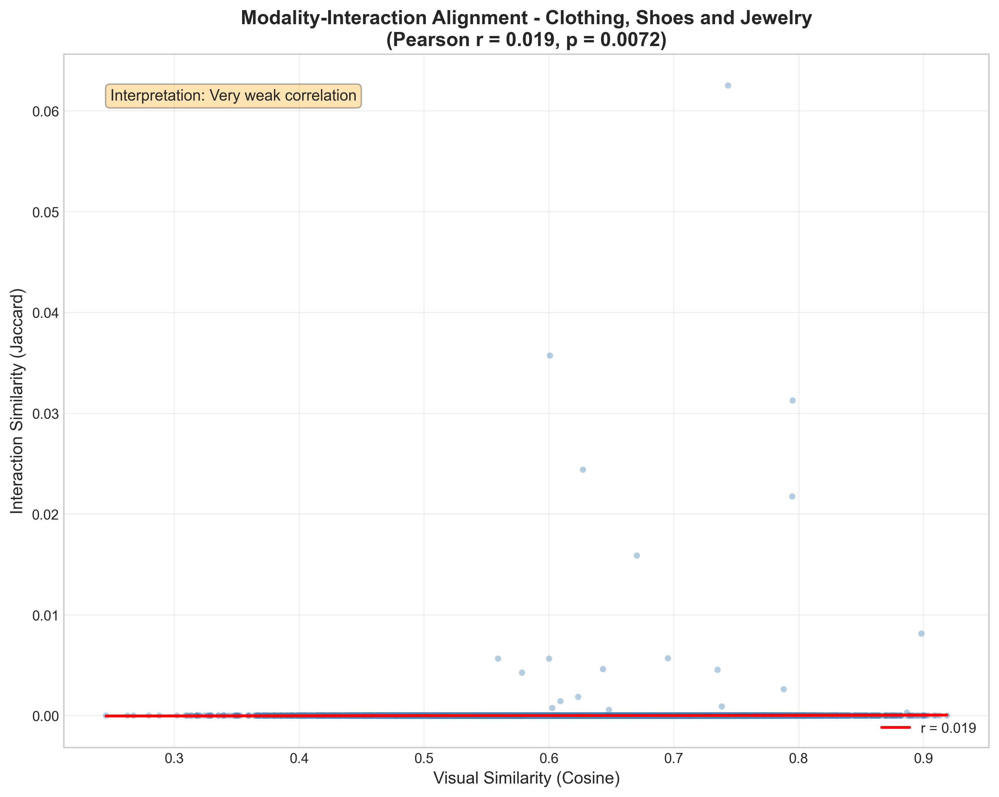

Tests the **Homophily Hypothesis**: Do visually similar items share similar interaction patterns?

| Metric | Value |
|--------|-------|
| Pairs Analyzed | 20,000 |
| Pearson r | 0.0164 |
| p-value | 0.0207 |
| Spearman ρ | 0.0215 |

**Interpretation:** Very weak correlation - visual signal exists but is minimal

### 10.2 Visual Manifold Structure (Xu et al., 2025)

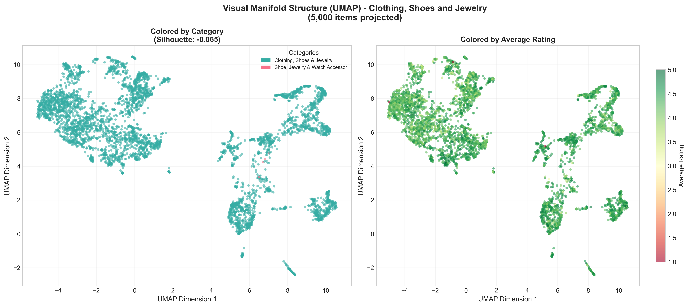

Analyzes whether CLIP embeddings form meaningful clusters by category.

| Metric | Value |
|--------|-------|
| Items Projected | 9,998 |
| Projection Method | UMAP |
| Silhouette Score | -0.0612 |
| Unique Categories | 2 |

**Interpretation:** No meaningful visual clustering - visual features may not align with categories

### 10.3 BPR Negative Sampling Hardness (Xu et al., 2025)

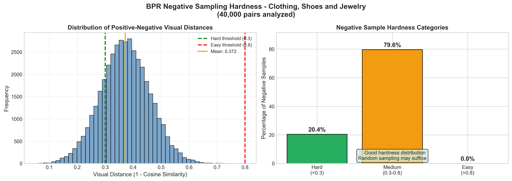

Evaluates whether random negative sampling produces informative training signal.

| Metric | Value |
|--------|-------|
| Users Analyzed | 2,000 |
| Pairs Analyzed | 40,000 |
| Mean Visual Distance | 0.3665 |
| Easy Negatives (>0.8) | 0.0% |
| Medium Negatives | 77.9% |
| Hard Negatives (<0.3) | 22.1% |

**Interpretation:** Moderate negative difficulty - room for improvement

**Recommendation:** Consider mixing random and hard negative sampling

### 10.4 Text Embedding Extraction (Sentence-BERT)

| Metric | Value |
|--------|-------|
| Model | `sentence-transformers/all-mpnet-base-v2` |
| Items Processed | 25,000 |
| Success Rate | 100.0% |
| Embedding Dimension | 768 |
| Processing Time | 289.0s |
| Throughput | 86.5 items/sec |
| Avg Text Length | 457 chars |

### 10.5 Semantic-Interaction Alignment (Text)

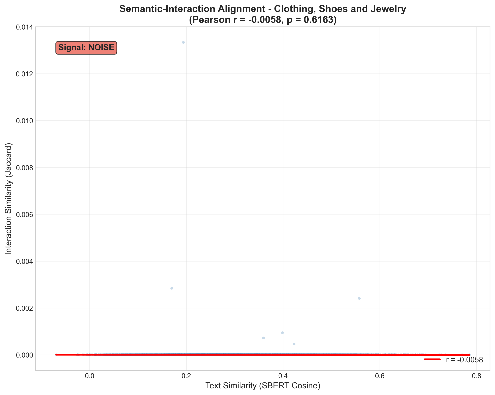

Tests whether items with similar text descriptions have similar buyers.

| Metric | Value |
|--------|-------|
| Pairs Analyzed | 7,500 |
| Pearson r | 0.004 |
| p-value | 0.7305 |
| Mean Text Similarity | 0.3074 |
| Mean Interaction Similarity | 0.0000 |
| **Signal Strength** | 🔴 NOISE |

**Interpretation:** Very weak correlation (r=0.0040): Text descriptions do NOT predict user behavior. Users likely buy based on visual appeal, brand, or price rather than descriptions.

**Recommendation:** Deprioritize text encoder in final model, or use text only as filter/fallback.

### 10.6 Cross-Modal Consistency (Text vs Image)

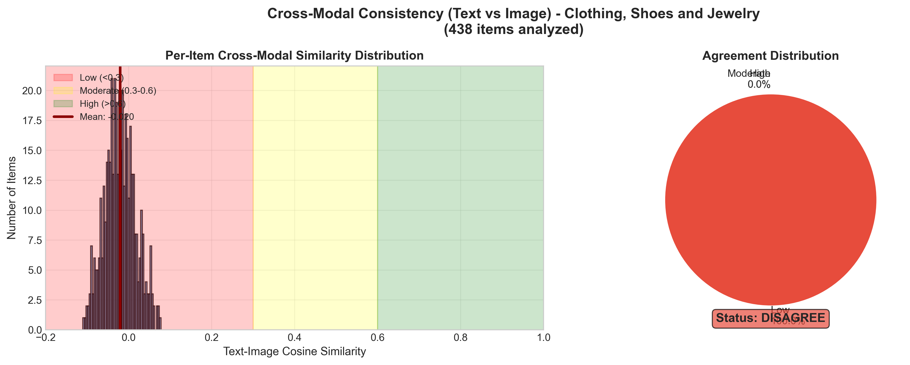

Measures whether text and image embeddings agree for the same items.

| Metric | Value |
|--------|-------|
| Items with Both Modalities | 872 |
| Projection Method | linear |
| Text Dim → Projected | 768 → 768 |
| Image Dim → Projected | 768 → 768 |
| **Mean Similarity** | -0.0166 |
| Std Similarity | 0.0384 |
| Low Agreement (<0.3) | 100.0% |
| Moderate (0.3-0.6) | 0.0% |
| High Agreement (>0.6) | 0.0% |
| **Status** | 🔴 DISAGREE |

**Interpretation:** LOW cross-modal agreement (avg=-0.017): Text and image embeddings point in different directions. This indicates a fundamental mismatch - either descriptions don't match images, or encoders have domain shift.

**Recommendation:** Investigate: (1) Check if product images match descriptions, (2) Fine-tune encoders on domain, (3) Use separate modality branches.

---

## 11. LATTICE Feasibility Assessment

> [!CAUTION]
> ⛔ **STOP** - LATTICE feasibility checks failed. Revisit Feature Extraction.

### 11.1 Graph Connectivity (k-NN, k=5)

| Metric | Value | Status |
|--------|-------|--------|
| Connected Components | 1 | - |
| Giant Component Size | 9,998 | - |
| Giant Component Coverage | 100.0% | ✅ PASS |
| Threshold | >50.0% | - |

**Interpretation:** PASS: Giant component covers 100.0% of items (threshold: 50.0%). Graph is sufficiently connected for LATTICE.

### 11.2 Feature Collapse Detection (White Wall Test)

| Metric | Value | Status |
|--------|-------|--------|
| Pairs Sampled | 50,000 | - |
| Avg Cosine Similarity | 0.6235 | ⚠️ WARNING |
| Std Cosine Similarity | 0.0891 | - |
| High Similarity Pairs (>0.9) | 0.1% | - |
| Pass Threshold | <0.5 | - |

**Interpretation:** WARNING: Avg cosine similarity = 0.624 (pass: <0.5, collapse: >0.9). Features show moderate similarity. May work but suboptimal. Consider testing with alternative visual encoder.

### Summary

| Check | Value | Status |
|-------|-------|--------|
| Alignment (Pearson r) | 0.0164 | ✅ |
| Connectivity (Giant %) | 100.0% | ✅ |
| No Collapse (Avg Cosine) | 0.6235 | ❌ |

**Decision:** STOP

---

*Report generated by EDA Pipeline for Multimodal Recommendation System*
