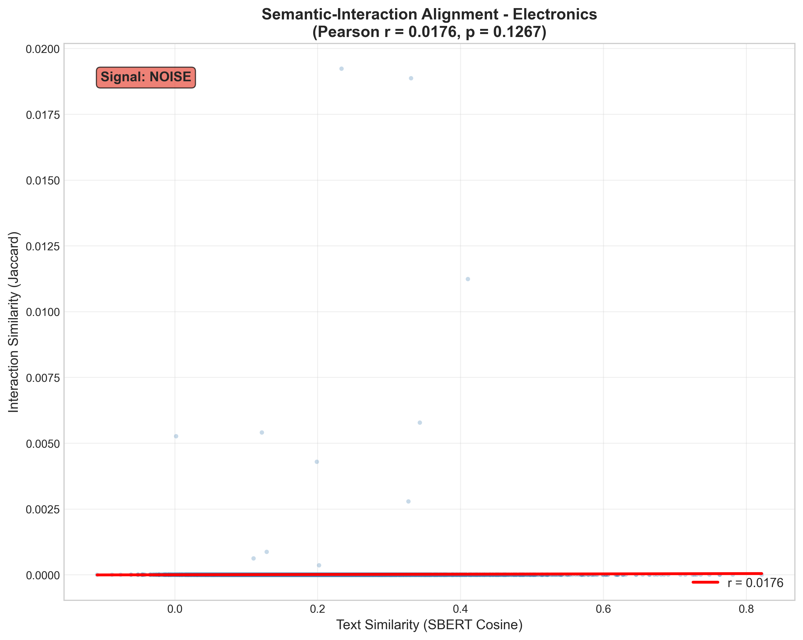
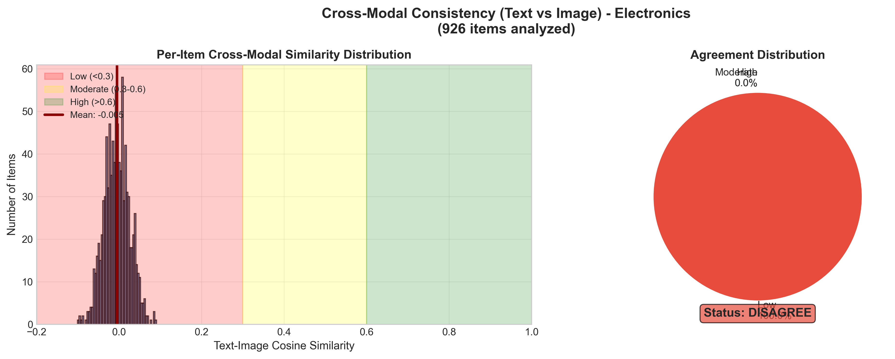
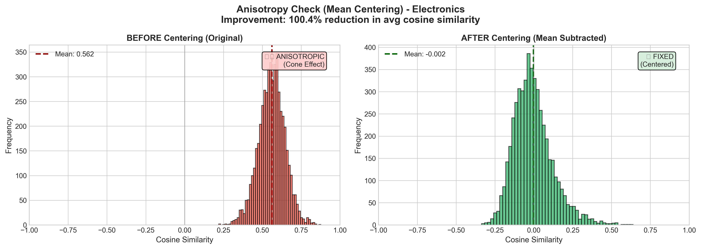
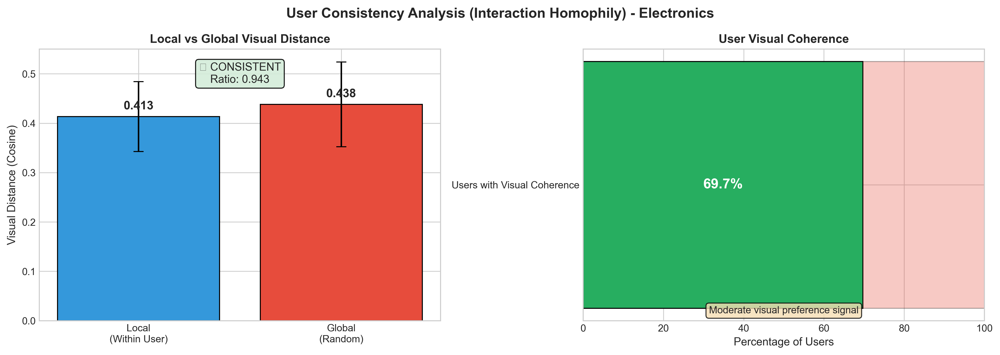

# EDA Report: Electronics

**Generated:** 2025-12-18T14:19:59.652981  
**Sampling Strategy:** random

---

## 1. Data Overview

### Loading Statistics

| Metric | Interactions | Metadata |
|--------|-------------|----------|
| Total Records | 15,473,536 | 1,610,012 |
| Sampled Records | 15,473,536 | 368,228 |
| Memory (MB) | 3822.0 | 893.19 |

### Interaction Statistics

| Metric | Value |
|--------|-------|
| Users | 1,641,026 |
| Items | 368,228 |
| Interactions | 15,473,536 |
| Avg Rating | 4.25 |
| Rating Std | 1.26 |
| Sparsity | 99.99743931% |

### 5-Core Validation

This dataset uses **5-core filtering**, ensuring every user and item has at least 5 interactions.
This removes cold-start users/items and creates a denser, more connected graph for recommendation algorithms.

| Property | Value | Status |
|----------|-------|--------|
| Min interactions/user | 5 | ✅ VALID |
| Min interactions/item | 5 | ✅ VALID |
| Avg interactions/user | 9.43 | - |
| Avg interactions/item | 42.02 | - |
| Median interactions/user | 7 | - |
| Median interactions/item | 12 | - |

> [!NOTE]
> **Density Analysis:** At 0.00256069% density, this dataset is extremely sparse - typical for raw e-commerce data before filtering.
> 
> **Benchmark Reference:**
> - Raw Amazon data: ~0.001-0.01% density (99.99%+ sparsity)
> - 5-core filtered: ~0.01-0.1% density (typical range)
> - MovieLens 20M: ~0.5% density (research benchmark)
> - Netflix Prize: ~1.2% density (denser due to explicit ratings)

---

## 2. Rating Distribution

| Rating | Count | Percentage |
|--------|-------|------------|
| 1.0 | 1,287,788 | 8.3% |
| 2.0 | 713,558 | 4.6% |
| 3.0 | 1,074,820 | 7.0% |
| 4.0 | 2,190,347 | 14.2% |
| 5.0 | 10,207,023 | 66.0% |

### Rating Skewness Analysis

| Metric | Value | Interpretation |
|--------|-------|----------------|
| Mean Rating | 4.25 | strongly left-skewed (positive bias) |
| % Positive (4-5 ⭐) | 80.1% | Unusual distribution |
| Rating Std | 1.26 | Moderate variance |

> [!TIP]
> **Insight:** Users preferentially leave reviews for products they like. Amazon reviews typically show 60-80% positive ratings due to self-selection bias.

---

## 3. User and Item Analysis

### Power-Law Distribution

**User Patterns:**
- Mean interactions/user: 9.43
- Median interactions/user: 7.0
- Cold-start users (<5 interactions): 0.0%
- Power-law exponent α: 2.75

**Item Patterns:**
- Mean interactions/item: 42.02
- Median interactions/item: 12.0
- Cold-start items (<5 interactions): 0.0%
- Power-law exponent α: 1.79

### Power-Law Fit Quality Interpretation

| Entity | α Value | Interpretation | Implication |
|--------|---------|----------------|-------------|
| Users | 2.75 | Good fit - typical power-law for recommendation data | Standard sampling OK |
| Items | 1.79 | Flatter distribution - popularity more evenly spread | Uniform negative sampling acceptable |

> [!NOTE]
> **Power-Law Reference:** α ≈ 2.0-3.0 indicates a well-behaved power-law typical for recommendation systems.
> - α < 2.0: Distribution is relatively flat (many active users/popular items)
> - α > 3.0: Extreme concentration (Pareto principle strongly applies)

### Pareto Analysis (Interaction Concentration)

Top users account for a disproportionate share of interactions:

| User Tier | % of Total Interactions |
|-----------|------------------------|
| Top 1% | 7.1% |
| Top 5% | 19.3% |
| Top 10% | 29.2% |
| Top 20% | 43.3% |
| Top 50% | 70.6% |
| Top 100% | 100.0% |

---

## 4. Temporal Analysis

**Date Range:** 1999-06-13 to 2023-09-12  
**Duration:** 8,856 days

---

## 5. Text Analysis

| Metric | Value |
|--------|-------|
| Avg Review Length | 0 chars |
| Avg Title Length | 0 chars |
| Reviews with Text | 0.0% |

---

## 6. Multimodal Analysis

### Feature Coverage

| Feature | Coverage |
|---------|----------|
| Title | 100.0% |
| Description | 56.0% |
| Features | 84.1% |
| Images | 100.0% |
| **Complete (Text + Image)** | 100.0% |

### Image Statistics

| Metric | Value |
|--------|-------|
| Items with Images | 368,188 |
| Avg Images/Item | 5.53 |

---

## 7. Sparsity and K-Core Analysis

**Matrix Sparsity:** 99.99743931%  
**Density:** 0.00256069%

### K-Core Filtering Impact

| k | Users Retained | Items Retained | Interactions Retained |
|---|----------------|----------------|----------------------|
| 5 | 100.0% | 100.0% | 100.0% |
| 10 | 21.1% | 33.2% | 38.4% |
| 15 | 5.3% | 10.0% | 13.1% |
| 20 | 0.0% | 0.0% | 0.0% |

---

## 8. Category Distribution

Top categories in the dataset:

| Category | Count |
|----------|-------|
| Electronics | 349,134 |
| All Electronics | 8,196 |
| Computers | 5,026 |
| Home Audio & Theater | 1,551 |
| Amazon Devices | 1,381 |
| Camera & Photo | 1,039 |
| Apple Products | 628 |
| Car & Vehicle Electronics | 472 |
| Car Electronics | 407 |
| Amazon Devices & Accessories | 173 |

---

## 9. Data-Driven Insights and Recommendations

### Dataset Quality Assessment

| Aspect | Finding | Implication |
|--------|---------|-------------|
| **5-Core Status** | ✅ 5-core validation passed - dataset is properly filtered | No additional k-core filtering needed; proceed with model training |
| **Sparsity** | Extreme sparsity (<0.01% density) - collaborative filtering alone may struggle | Strongly recommend hybrid approach with content-based features (text/image embeddings) |
| **Long-Tail** | User α=2.75, Item α=1.79 | Standard random sampling is acceptable for training |
| **Cold-Start** | Cold-start is minimal (0.0% users, 0.0% items) thanks to 5-core filtering | Focus on recommendation quality rather than cold-start mitigation |

### Actionable Recommendations

1. **Multimodal Features:** At 0.00256069% density, leverage text and image embeddings to enrich item representations. CLIP or Sentence-BERT embeddings can bridge sparse interaction signals.

2. **Rating Bias Correction:** Mean rating of 4.25 indicates strong positive bias. Consider using implicit feedback (interactions) rather than explicit ratings for training.

3. **Ready for Training:** 5-core filtering ensures sufficient interaction density. Proceed with LATTICE, LightGCN, or other graph-based methods.

4. **Visual Feature Extraction:** With 100% image coverage, consider CLIP-based visual embeddings for multimodal recommendation.

---

## 10. Multimodal Recommendation Readiness (Academic Analysis)

### 10.1 Modality-Interaction Alignment (Liu et al., 2024)

Tests the **Homophily Hypothesis**: Do visually similar items share similar interaction patterns?

| Metric | Value |
|--------|-------|
| Pairs Analyzed | 20,000 |
| Pearson r | 0.0158 |
| p-value | 0.0251 |
| Spearman ρ | 0.0131 |

**Interpretation:** Very weak correlation - visual signal exists but is minimal

### 10.2 Visual Manifold Structure (Xu et al., 2025)

Analyzes whether CLIP embeddings form meaningful clusters by category.

| Metric | Value |
|--------|-------|
| Items Projected | 9,999 |
| Projection Method | UMAP |
| Silhouette Score | -0.4634 |
| Unique Categories | 12 |

**Interpretation:** No meaningful visual clustering - visual features may not align with categories

### 10.3 BPR Negative Sampling Hardness (Xu et al., 2025)

Evaluates whether random negative sampling produces informative training signal.

| Metric | Value |
|--------|-------|
| Users Analyzed | 2,000 |
| Pairs Analyzed | 40,000 |
| Mean Visual Distance | 0.4357 |
| Easy Negatives (>0.8) | 0.0% |
| Medium Negatives | 95.3% |
| Hard Negatives (<0.3) | 4.7% |

**Interpretation:** Moderate negative difficulty - room for improvement

**Recommendation:** Consider mixing random and hard negative sampling

### 10.4 Text Embedding Extraction (Sentence-BERT)

| Metric | Value |
|--------|-------|
| Model | `sentence-transformers/all-mpnet-base-v2` |
| Items Processed | 25,000 |
| Success Rate | 100.0% |
| Embedding Dimension | 768 |
| Processing Time | 268.1s |
| Throughput | 93.2 items/sec |
| Avg Text Length | 438 chars |

### 10.5 Semantic-Interaction Alignment (Text)

Tests whether items with similar text descriptions have similar buyers.

| Metric | Value |
|--------|-------|
| Pairs Analyzed | 7,500 |
| Pearson r | 0.0176 |
| p-value | 0.1267 |
| Mean Text Similarity | 0.1961 |
| Mean Interaction Similarity | 0.0000 |
| **Signal Strength** | 🔴 NOISE |

**Interpretation:** Very weak correlation (r=0.0176): Text descriptions do NOT predict user behavior. Users likely buy based on visual appeal, brand, or price rather than descriptions.

**Recommendation:** Deprioritize text encoder in final model, or use text only as filter/fallback.

### 10.6 Cross-Modal Consistency (Text vs Image)

Measures whether text and image embeddings agree for the same items.

| Metric | Value |
|--------|-------|
| Items with Both Modalities | 926 |
| Projection Method | linear |
| Text Dim → Projected | 768 → 768 |
| Image Dim → Projected | 768 → 768 |
| **Mean Similarity** | -0.0053 |
| Std Similarity | 0.0306 |
| Low Agreement (<0.3) | 100.0% |
| Moderate (0.3-0.6) | 0.0% |
| High Agreement (>0.6) | 0.0% |
| **Status** | 🔴 DISAGREE |

**Interpretation:** LOW cross-modal agreement (avg=-0.005): Text and image embeddings point in different directions. This indicates a fundamental mismatch - either descriptions don't match images, or encoders have domain shift.

**Recommendation:** Investigate: (1) Check if product images match descriptions, (2) Fine-tune encoders on domain, (3) Use separate modality branches.

### 10.7 CCA Cross-Modal Analysis

Canonical Correlation Analysis measures linear relationship capacity between modalities.

| Metric | Value |
|--------|-------|
| Items Analyzed | 926 |
| CCA Components | 10 |
| Mean CCA Correlation | 1.0000 |
| Top-5 Correlations | 1.000, 1.000, 1.000, 1.000, 1.000 |

**Interpretation:** STRONG CCA correlation (1.000). Good linear relationship between modalities.

**Recommendation:** MICRO contrastive loss should converge well.

### 10.8 Anisotropy Check (Signal Crisis Fix)

Detects "Cone Effect" in embeddings and tests if mean centering helps.

| Metric | Before Centering | After Centering |
|--------|------------------|-----------------|
| Avg Cosine Similarity | 0.5623 | 0.0005 |
| Std Cosine Similarity | 0.0857 | 0.1289 |
| Pairs Sampled | 20,000 | - |
| Improvement Ratio | 99.9% | - |
| **Status** | ⚠️ ANISOTROPIC | - |

**Interpretation:** ANISOTROPIC: Avg cosine = 0.562 (>0.4). Centering FIXED the issue: after centering = 0.000. Embeddings were in a narrow cone but centering spread them out.

**Recommendation:** Apply mean centering to all embeddings before using in MRS models. This should significantly improve LATTICE/MICRO performance.

### 10.9 User Consistency (Interaction Homophily)

Measures whether users buy visually similar items (validates visual MRS approach).

| Metric | Value |
|--------|-------|
| Users Analyzed | 1,500 |
| Users with ≥5 Items | 1,641,026 |
| Mean Local Distance | 0.4133 |
| Mean Global Distance | 0.4380 |
| **Consistency Ratio** | 0.9435 |
| Users with Visual Coherence | 69.7% |
| **Status** | ✅ CONSISTENT |

**Interpretation:** MODERATE CONSISTENCY: Some visual preference signal exists. Local (0.413) < Global (0.438). Ratio = 0.943.

**Recommendation:** Visual features have some predictive power. Consider combining with text features for better performance.

---

## 11. LATTICE Feasibility Assessment

> [!CAUTION]
> ⛔ **STOP** - LATTICE feasibility checks failed. Revisit Feature Extraction.

### 11.1 Graph Connectivity (k-NN, k=5)

| Metric | Value | Status |
|--------|-------|--------|
| Connected Components | 4 | - |
| Giant Component Size | 9,957 | - |
| Giant Component Coverage | 99.6% | ✅ PASS |
| Threshold | >50.0% | - |

**Interpretation:** PASS: Giant component covers 99.6% of items (threshold: 50.0%). Graph is sufficiently connected for LATTICE.

### 11.2 Feature Collapse Detection (White Wall Test)

| Metric | Value | Status |
|--------|-------|--------|
| Pairs Sampled | 50,000 | - |
| Avg Cosine Similarity | 0.5625 | ⚠️ WARNING |
| Std Cosine Similarity | 0.0847 | - |
| High Similarity Pairs (>0.9) | 0.0% | - |
| Pass Threshold | <0.5 | - |

**Interpretation:** WARNING: Avg cosine similarity = 0.563 (pass: <0.5, collapse: >0.9). Features show moderate similarity. May work but suboptimal. Consider testing with alternative visual encoder.

### Summary

| Check | Value | Status |
|-------|-------|--------|
| Alignment (Pearson r) | 0.0158 | ✅ |
| Connectivity (Giant %) | 99.6% | ✅ |
| No Collapse (Avg Cosine) | 0.5625 | ❌ |

**Decision:** STOP

---

*Report generated by EDA Pipeline for Multimodal Recommendation System*
