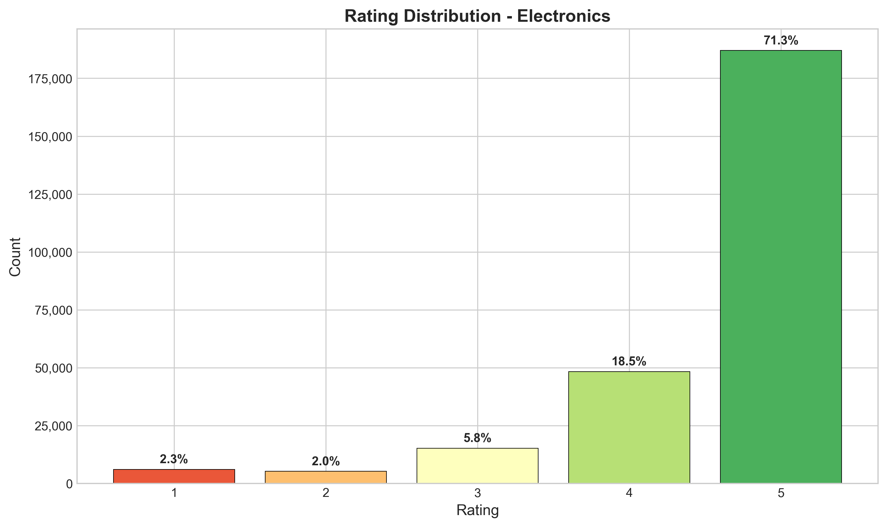
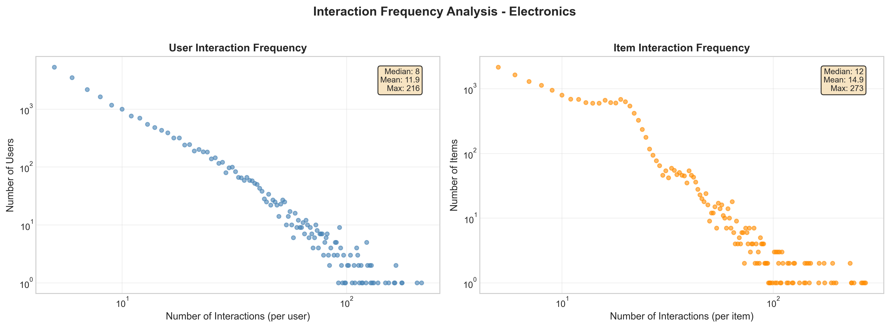
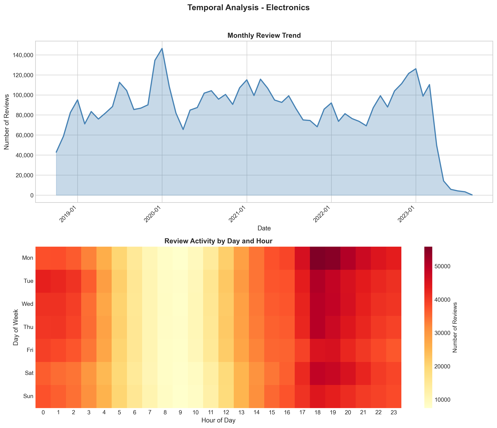
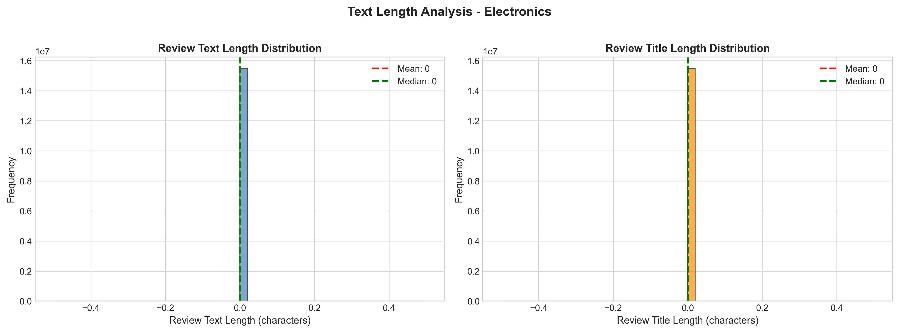
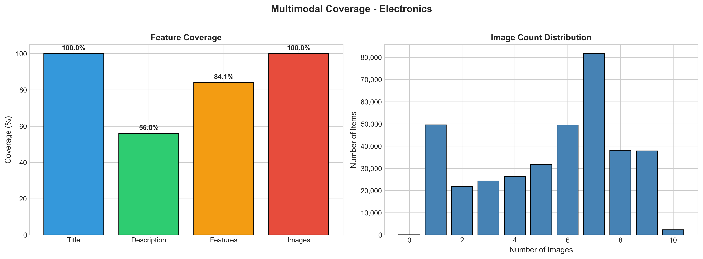
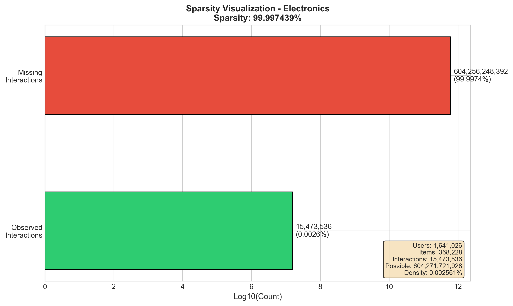
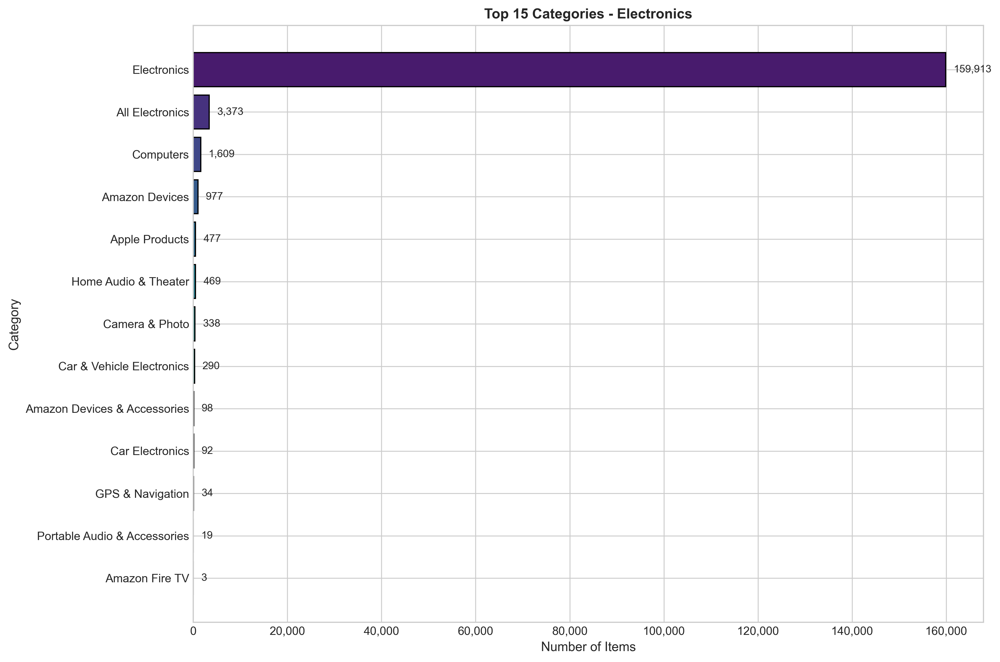
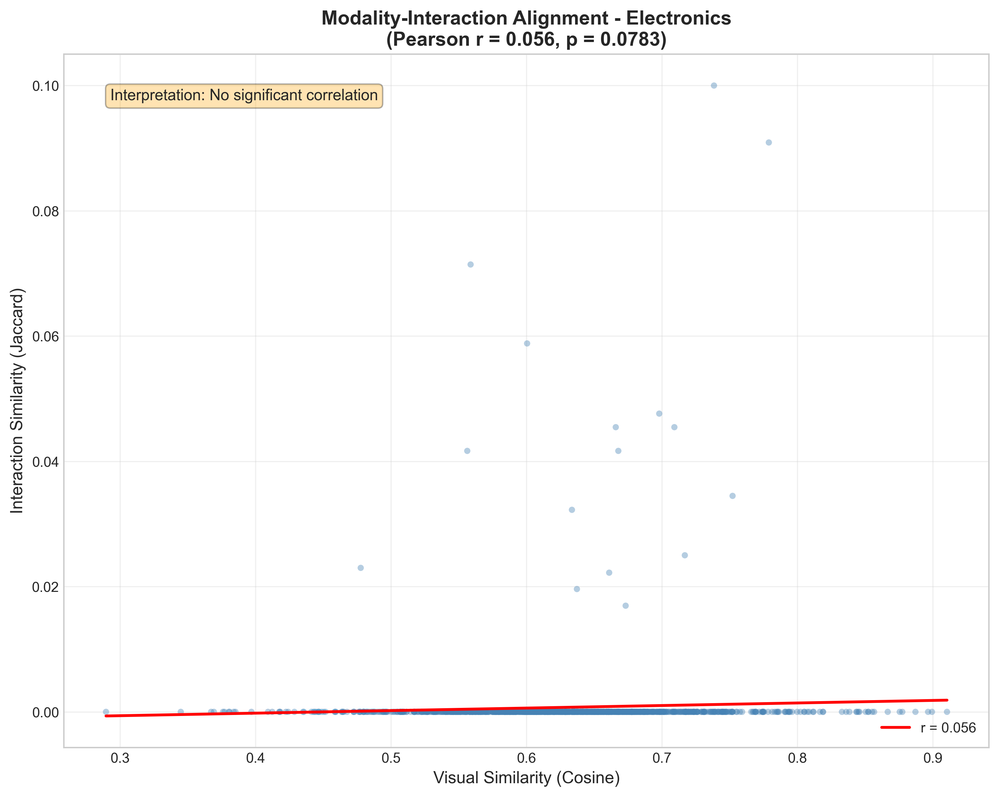
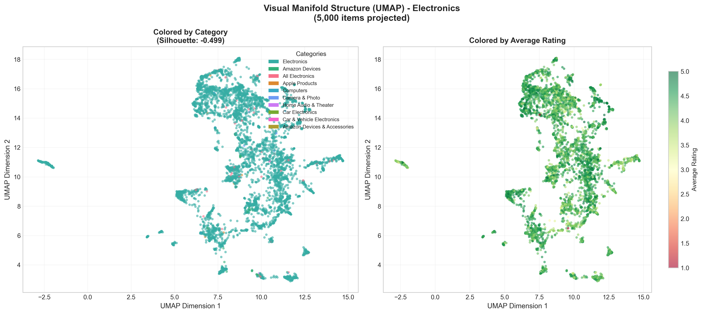
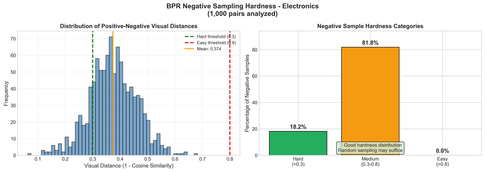

# EDA Report: Electronics

**Generated:** 2025-12-17T17:17:47.143643  
**Sampling Strategy:** Dense (K-Core k=5 + 12 months)

---

## 1. Data Overview

### Loading Statistics

| Metric | Interactions | Metadata |
|--------|-------------|----------|
| Total Records | 43,886,944 | 1,610,012 |
| Sampled Records | 262,076 | 17,600 |
| Memory (MB) | 236.37 | 56.97 |

### Interaction Statistics

| Metric | Value |
|--------|-------|
| Users | 21,955 |
| Items | 17,600 |
| Interactions | 262,076 |
| Avg Rating | 4.54 |
| Rating Std | 0.88 |
| Sparsity | 99.93217635% |

---

## 2. Rating Distribution

| Rating | Count | Percentage |
|--------|-------|------------|
| 1.0 | 6,130 | 2.3% |
| 2.0 | 5,284 | 2.0% |
| 3.0 | 15,292 | 5.8% |
| 4.0 | 48,385 | 18.5% |
| 5.0 | 186,985 | 71.3% |

---

## 3. User and Item Analysis

### Power-Law Distribution

**User Patterns:**
- Mean interactions/user: 11.94
- Median interactions/user: 8.0
- Cold-start users (<5 interactions): 0.0%
- Power-law exponent α: 2.40

**Item Patterns:**
- Mean interactions/item: 14.89
- Median interactions/item: 12.0
- Cold-start items (<5 interactions): 0.0%
- Power-law exponent α: 2.03

### Pareto Analysis (Interaction Concentration)

Top users account for a disproportionate share of interactions:

| User Tier | % of Total Interactions |
|-----------|------------------------|
| Top 1% | 7.5% |
| Top 5% | 22.2% |
| Top 10% | 33.9% |
| Top 20% | 49.7% |
| Top 50% | 76.0% |
| Top 100% | 100.0% |

---

## 4. Temporal Analysis

**Date Range:** 2022-09-18 to 2023-09-09  
**Duration:** 356 days

---

## 5. Text Analysis

| Metric | Value |
|--------|-------|
| Avg Review Length | 526 chars |
| Avg Title Length | 29 chars |
| Reviews with Text | 100.0% |

---

## 6. Multimodal Analysis

### Feature Coverage

| Feature | Coverage |
|---------|----------|
| Title | 100.0% |
| Description | 20.9% |
| Features | 97.0% |
| Images | 100.0% |
| **Complete (Text + Image)** | 100.0% |

### Image Statistics

| Metric | Value |
|--------|-------|
| Items with Images | 17,600 |
| Avg Images/Item | 7.12 |

---

## 7. Sparsity and K-Core Analysis

**Matrix Sparsity:** 99.93217635%  
**Density:** 0.06782365%

### K-Core Filtering Impact

| k | Users Retained | Items Retained | Interactions Retained |
|---|----------------|----------------|----------------------|
| 2 | 100.0% | 100.0% | 100.0% |
| 3 | 100.0% | 100.0% | 100.0% |
| 5 | 100.0% | 100.0% | 100.0% |
| 10 | 21.5% | 32.9% | 35.4% |
| 20 | 0.0% | 0.0% | 0.0% |

---

## 8. Category Distribution

Top categories in the dataset:

| Category | Count |
|----------|-------|
| Electronics | 17,109 |
| Amazon Devices | 206 |
| All Electronics | 134 |
| Apple Products | 73 |
| Computers | 38 |
| Car & Vehicle Electronics | 14 |
| Camera & Photo | 11 |
| Amazon Devices & Accessories | 6 |
| Home Audio & Theater | 6 |
| Car Electronics | 2 |

---

## 9. Key Insights and Recommendations

### Data Quality
1. **High Sparsity:** The dataset exhibits extreme sparsity typical of recommendation datasets
2. **Power-Law Distribution:** Both users and items follow power-law distributions (long-tail)
3. **Cold-Start Challenge:** Significant portion of users/items have few interactions

### Preprocessing Recommendations
1. **K-Core Filtering:** Use k=5 as baseline (balances data quality vs. coverage)
2. **Multimodal Features:** Leverage text/image to address cold-start problem
3. **Negative Sampling:** Use popularity-based hard negative sampling for BPR

---

## 10. Multimodal Recommendation Readiness (Academic Analysis)

### 10.1 Modality-Interaction Alignment (Liu et al., 2024)

Tests the **Homophily Hypothesis**: Do visually similar items share similar interaction patterns?

| Metric | Value |
|--------|-------|
| Pairs Analyzed | 1,000 |
| Pearson r | 0.0557 |
| p-value | 0.0783 |
| Spearman ρ | 0.0547 |

**Interpretation:** No significant correlation - visual features may not align with user preferences

### 10.2 Visual Manifold Structure (Xu et al., 2025)

Analyzes whether CLIP embeddings form meaningful clusters by category.

| Metric | Value |
|--------|-------|
| Items Projected | 5,000 |
| Projection Method | UMAP |
| Silhouette Score | -0.4987 |
| Unique Categories | 10 |

**Interpretation:** No meaningful visual clustering - visual features may not align with categories

### 10.3 BPR Negative Sampling Hardness (Xu et al., 2025)

Evaluates whether random negative sampling produces informative training signal.

| Metric | Value |
|--------|-------|
| Users Analyzed | 100 |
| Pairs Analyzed | 1,000 |
| Mean Visual Distance | 0.3738 |
| Easy Negatives (>0.8) | 0.0% |
| Medium Negatives | 81.8% |
| Hard Negatives (<0.3) | 18.2% |

**Interpretation:** Moderate negative difficulty - room for improvement

**Recommendation:** Consider mixing random and hard negative sampling

---

## 11. LATTICE Feasibility Assessment

> [!CAUTION]
> ⛔ **STOP** - LATTICE feasibility checks failed. Revisit Feature Extraction.

### 11.1 Graph Connectivity (k-NN, k=5)

| Metric | Value | Status |
|--------|-------|--------|
| Connected Components | 1 | - |
| Giant Component Size | 5,000 | - |
| Giant Component Coverage | 100.0% | ✅ PASS |
| Threshold | >50.0% | - |

**Interpretation:** PASS: Giant component covers 100.0% of items (threshold: 50.0%). Graph is sufficiently connected for LATTICE.

### 11.2 Feature Collapse Detection (White Wall Test)

| Metric | Value | Status |
|--------|-------|--------|
| Pairs Sampled | 10,000 | - |
| Avg Cosine Similarity | 0.6265 | ⚠️ WARNING |
| Std Cosine Similarity | 0.0862 | - |
| High Similarity Pairs (>0.9) | 0.1% | - |
| Pass Threshold | <0.5 | - |

**Interpretation:** WARNING: Avg cosine similarity = 0.626 (pass: <0.5, collapse: >0.9). Features show moderate similarity. May work but suboptimal. Consider testing with alternative visual encoder.

### Summary

| Check | Value | Status |
|-------|-------|--------|
| Alignment (Pearson r) | 0.0557 | ✅ |
| Connectivity (Giant %) | 100.0% | ✅ |
| No Collapse (Avg Cosine) | 0.6265 | ❌ |

**Decision:** STOP

---

*Report generated by EDA Pipeline for Multimodal Recommendation System*
